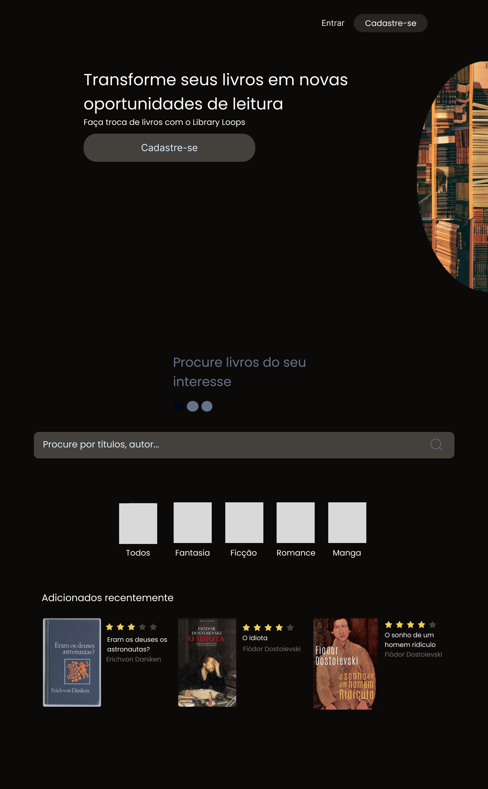
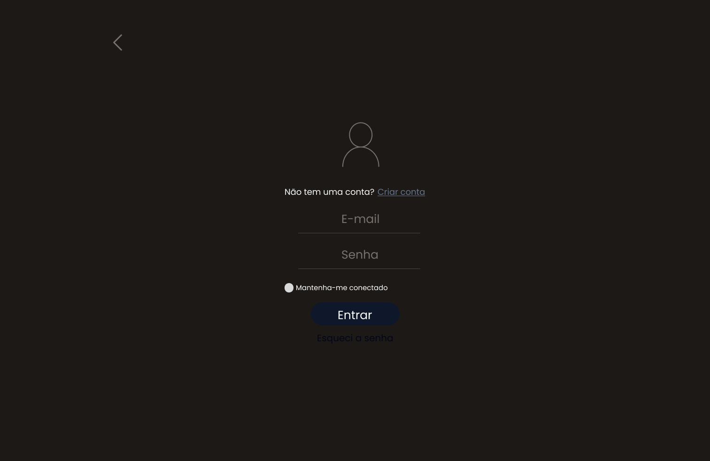
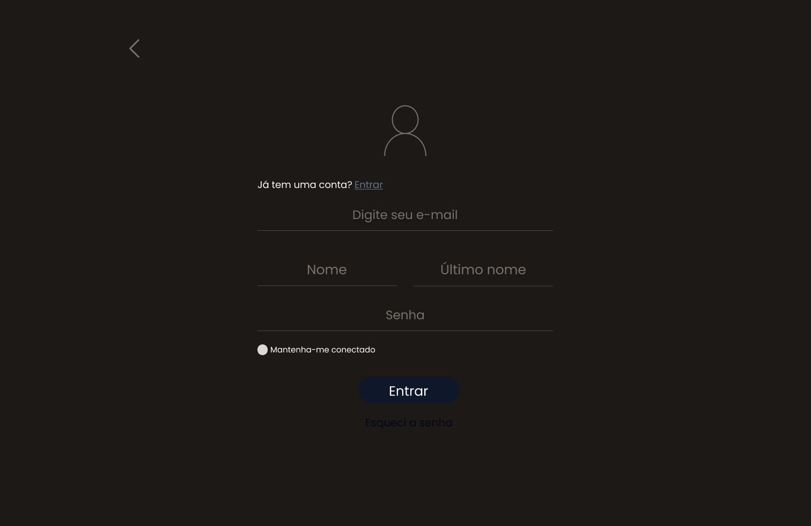

  

<p  align="center">

<a  href="https://github.com/LibraryLoops">


</a>

  

<a  href="https://github.com/LibraryLoops/librarytech-front/commits/main">


</a>

  

</p>

<h1  align="center">


</h1>

  

<h4  align="center">

🚧 Library Tech - Front-End 🚀 em desenvolvimento 🚧

</h4>

  

<p  align="center">

• <a  href="#-sobre-o-projeto">Sobre</a>

• <a  href="#-entregas-do-projeto">Entregas do Projeto</a>

• <a  href="#-layout">Layout</a>

• <a  href="#-como-executar-o-projeto">Como executar</a>

• <a  href="#-tecnologias">Tecnologias</a>

• <a  href="#-autores">Autores</a>

</p>

  
  

## 💻 Sobre o projeto

  

Esse projeto faz parte da entrega 3 -Desenvolvimento do Frontend e Integração com o Backend da equipe Library Tech do Bootcamp de desenvolvimento Fullstack do Avanti/Atlântico.

  

Ele será o Frontend que irá fazer o cadastro de novos usuários, login e o processo de CRUD dos livros.

  

---
  

## 📑 Entregas do projeto

  

- Implementar o frontend utilizando React;

- Criar um CRUD para livros e usuários. ;

- Conectar o frontend à API desenvolvida na fase anterior, garantindo que as
operações citadas no item anterior sejam executadas corretamente;  
  

---

## 🎨 Layout

O layout da aplicação está disponível no Figma:

<a href="https://www.figma.com/design/EfxH0cGWFCgXL3F7RF2IMM/library-loops?node-id=0-1&t=3xg3OV0uJ0WTWwIp-1">
  
</a>

### Web

<p align="center" style="display: flex; align-items: flex-start; justify-content: center;">
  
  
  
</p>


---

## 🚀 Como executar o projeto

Este projeto é divido em duas partes:
1. Backend
2. Frontend

Para o Frontend funcionar adequadamente, é necessário que o Backend esteja sendo executado para funcionar.
  

### 🎲 Rodando o Backend (API)

Para saber como rodar o Backend (API), acesse esse [link](https://github.com/LibraryLoops/entrega2-api).  


### 🎲 Rodando o FrontEnd

```bash

# Clone este repositório
$ git clone git@github.com:LibraryLoops/librarytech-front.git

# Acesse a pasta do projeto no seu terminal/cmd
$ cd librarytech-front

# Instale as dependências
$ npm install

# Execute a aplicação em modo de desenvolvimento
$ npm run dev

# A aplicação será aberta na porta:5173 - acesse http://localhost:5173

```

---

## 🛠 Tecnologias

  

As seguintes ferramentas foram usadas na construção do projeto:


#### **FrontEnd** ([React](https://reactjs.org/))

  
-   **[Vite](https://vitejs.dev/)**
-   **[React Router Dom](https://github.com/ReactTraining/react-router/tree/master/packages/react-router-dom)**
-   **[Hero Icons](https://heroicons.com/)**
-   **[Axios](https://github.com/axios/axios)**
-   **[Tailwind CSS](https://tailwindcss.com/docs/installation)**
-   **[JWT Decode](https://github.com/auth0/jwt-decode)**


#### **Utilitários**

- Editor: **[Visual Studio Code](https://code.visualstudio.com/)**
- Markdown: **[StackEdit](https://stackedit.io/)**, **[Markdown Emoji](https://gist.github.com/rxaviers/7360908)**


---

## 🦸 Autores

  

<a  href="https://github.com/Dirceusljr">


<br  />
<sub><b>Dirceu dos Santos</b></sub></a>  <a  href="https://github.com/Dirceusljr"  title="Github">🏊</a>
<br />
<br />

[](https://www.linkedin.com/in/dirceusljr/)
[](https://github.com/Dirceusljr)
[](mailto:dirceusljr@gmail.com)


<a  href="https://github.com/alexandrosousadev">


<br  />
<sub><b>Alexandro Sousa</b></sub></a>  <a  href="https://github.com/alexandrosousadev"  title="Github">🚀</a>
<br />
<br />

[](https://www.linkedin.com/in/alexandrosousa009/)
[](https://github.com/alexandrosousadev)
[](mailto:alexandrosousa01@gmail.com)


<a href="https://github.com/heloisacativo">


<br />
<sub><b>Heloisa Cativo</b><sub></a> <a  href="https://github.com/heloisacativo" <title="Github">🐭</a>
<br />
<br />

[](https://www.linkedin.com/in/helenacativo/)
[](https://github.com/heloisacativo)
[](mailto:heloisacativo@gmail.com)
<br />
<br />

<a  href="https://github.com/THIAGOFELIPEFEI">


<br  />
<sub><b>Thiago Batista</b></sub></a>  <a  href="https://github.com/THIAGOFELIPEFEI"  title="Github">🚀</a>
<br />
<br />

[](https://www.linkedin.com/in/thiago-ff-batista/)
[](https://github.com/THIAGOFELIPEFEI)
[](mailto:thiagodexterpes@gmail.com)

<a  href="https://github.com/lucio-adriano">


<br  />
<sub><b>Thiago Batista</b></sub></a>  <a  href="https://github.com/lucio-adriano"  title="Github">🚀</a>
<br />
<br />

[](https://www.linkedin.com/in/adrianolucio/)
[](https://github.com/lucio-adriano)

---
